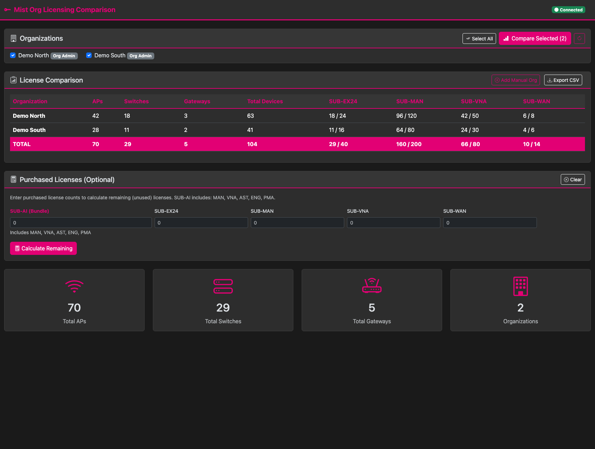
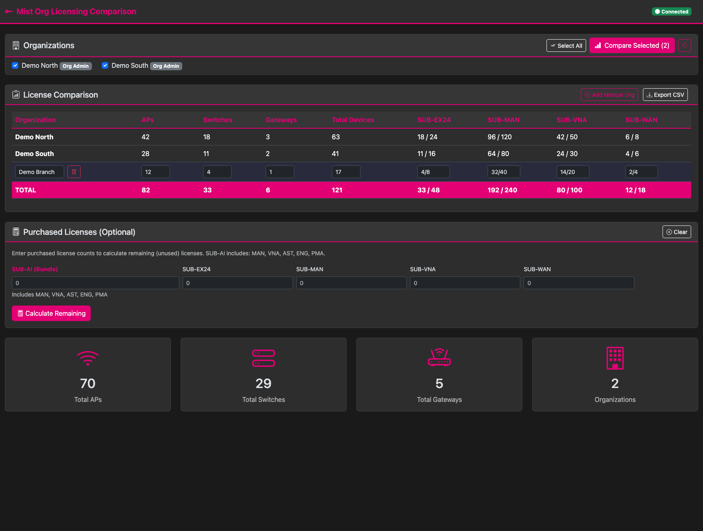
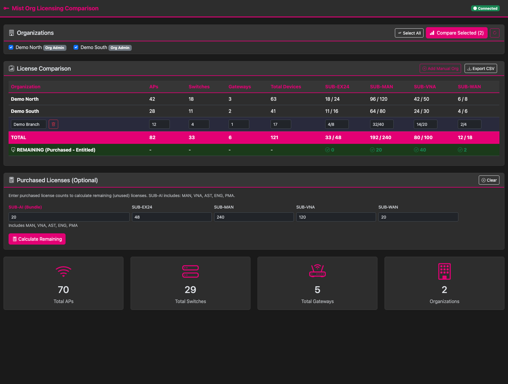

# MistOrgLicensingComparison

## What

Compare Juniper Mist organization license usage, entitlements, device inventory, and purchased license balances in one self-hosted dashboard. Select multiple organizations, review the comparison, add manual entries, and export a CSV.

The screenshots use synthetic sample data in the real application UI; no Mist account or live organization data is shown.







## How

For a local run on macOS or Linux, install Python 3.13 and Git, then run:

```bash
git clone https://github.com/jmorrison-juniper/MistOrgLicensingComparison.git
cd MistOrgLicensingComparison
python3.13 -m venv .venv
source .venv/bin/activate
python -m pip install -r requirements.lock.txt
cp .env.example .env
```

Edit `.env` and set `MIST_API_TOKEN` to a token with access to the organizations you need.
Keep the token in `.env`, which Git ignores. Start the app:

```bash
python app.py
```

Open <http://127.0.0.1:5000> in your browser.
Warning: the app has no sign-in page. Anyone who can connect to its port can use it.

See the [deployment guide](docs/DEPLOYMENT.md) for container instructions and configuration, the [user guide](docs/USER_GUIDE.md) for dashboard instructions, and the [API reference](docs/API.md) for endpoints.

## Where

This is a self-hosted Flask application. It connects to the Mist API host you configure and is available to users who can reach the host where you run it. Source code and contribution instructions are in this [repository](https://github.com/jmorrison-juniper/MistOrgLicensingComparison).

## When

Use the dashboard whenever you need an up-to-date comparison: license and inventory values are fetched when you request a comparison. Enter purchased counts when you want to calculate the remaining balance against current entitlements.

## Why

Organization-by-organization license and device totals are easier to review together. The app also includes bundle-aware remaining-license calculations and supports manual organizations that are not accessible through the configured Mist API tokens.

## Who

Built for Juniper Mist administrators managing multiple organizations. Developers can find the project layout, offline tests, quality checks, and contribution guidance in the [development guide](docs/DEVELOPMENT.md). The project is licensed under [CC BY-NC-SA 4.0](LICENSE).
